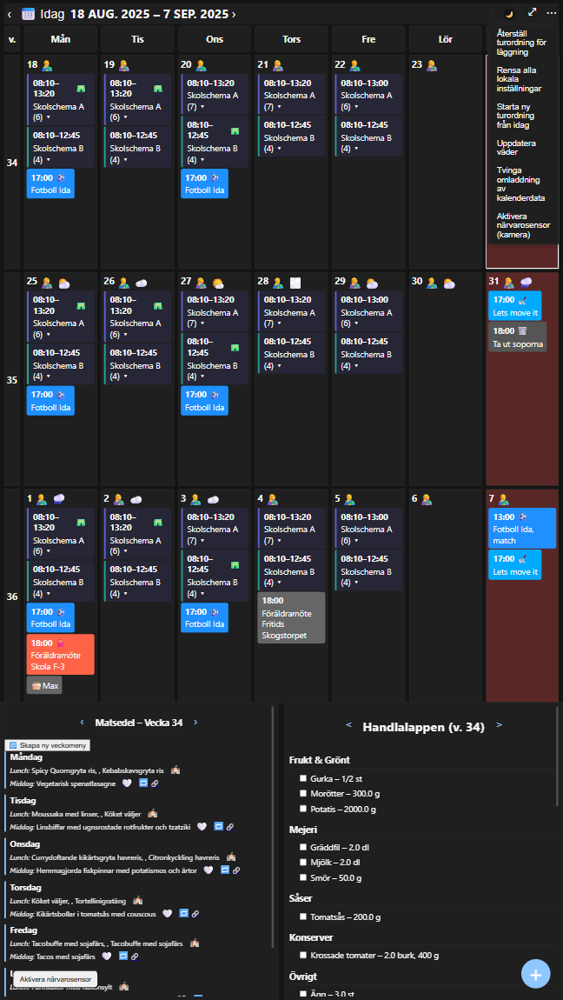

# Family Wall

Family Wall är en smart digital familjehub för hemmet. Den samlar kalender, matsedel, inköpslista, födelsedagar och väder i en överskådlig vy – direkt på surfplatta eller dator. Allt uppdateras automatiskt via API:er så att familjen slipper dubbeljobb och manuella uppdateringar.

---

## Varför Family Wall?
- **Allt på ett ställe.** Kalender, väder, matsedel och inköp i en tydlig vy.
- **AI som planerar åt er.** Varje vecka skapar en AI-agent en komplett matsedel utifrån skolmaten, familjens allergier, favoritmaträtter och vuxnas kalorimål. Den undviker upprepningar och håller variationen levande.
- **Automatisk inköpslista.** När veckans meny är klar genereras en inköpslista direkt till Supabase. Listan slår ihop identiska varor, filtrerar bort kryddor och skickar pushnotiser när någon lägger till något nytt.
- **Uppdateras av sig själv.**
  - **Skolscheman** hämtas automatiskt från Skola24.
  - **Skolmaten** läses in från skolmaten.se.
  - **Väder** kommer från SMHI:s öppna API.
  - **Födelsedagar och namnsdagar** läggs till som händelser i kalendern.
- **För familjer på riktigt.** Ikoner och färger gör det enkelt för barn att förstå kalendern, och turordning för läggning kan klickas fram och tillbaka med sparning i localStorage.

---

## Funktioner
- 📅 **Kalender** med skolhändelser, födelsedagar, namnsdagar och väder.
- 🎂 **Automatiska födelsedagar** (t.ex. “🎂Mormor”).
- 🌦️ **Dagliga väderikoner** direkt i kalendern.
- 🛒 **Shoppinglista** med Supabase-synk och web push-notiser.
- 🤖 **AI-agent** för matplanering som genererar meny + inköpslista varje vecka.
- 🔄 **Integrationer via API**: Skola24, skolmaten.se, SMHI, Supabase.

---

## Kom igång

### Backend (Flask)
```bash
git clone <repo-url>
cd backend
python3 -m venv .venv
source .venv/bin/activate
pip install -r requirements.txt
cp .env.example .env   # fyll i värden
python planera_api.py
```

### Frontend (React)
```bash
cd frontend
npm install
cp .env.example .env   # REACT_APP_API_BASE_URL=/api/ai
npm start
```

### Shopping-app (statisk)
Hostas som statisk sida (t.ex. one.com). Lägg din `config.js` bredvid `index.html` med Supabase-nycklar och VAPID public key.

---

## Miljövariabler

### Backend `.env`
```ini
TZ=Europe/Stockholm
LOG_LEVEL=INFO
ICS_URLS="<fulla ICS-URL:er via proxy>"
CACHE_TTL_MINUTES=5
SKOLA24_HOST=<ditt-skola24-host>
SKOLA24_SCHOOL="<din skola>"
SKOLA24_CLASSES="<klasslistor>"
```

### Frontend `.env`
```ini
REACT_APP_API_BASE_URL=/api/ai
```

### Shopping-app `config.js`
```js
window.FW_CONFIG = {
  SUPABASE_URL: "https://<project-ref>.supabase.co",
  SUPABASE_ANON_KEY: "<public anon key>",
  FUNCTIONS_BASE: "https://<project-ref>.functions.supabase.co",
  VAPID_PUBLIC_KEY: "<din vapid public key>"
};
```

---

## Produktion
- Kör backend via **Gunicorn** (2–3 workers) för att undvika deadlocks.
- Använd en **reverse proxy** (ex. Nginx) som mappar `https://<host>:3443/api/ai/*` → `http://127.0.0.1:5001/api/*`.
- Kör frontend på valfri webbserver (t.ex. serve, nginx).
- Shopping-appen kan hostas på valfri statisk hosting (t.ex. one.com).


## Licens
TBD.

